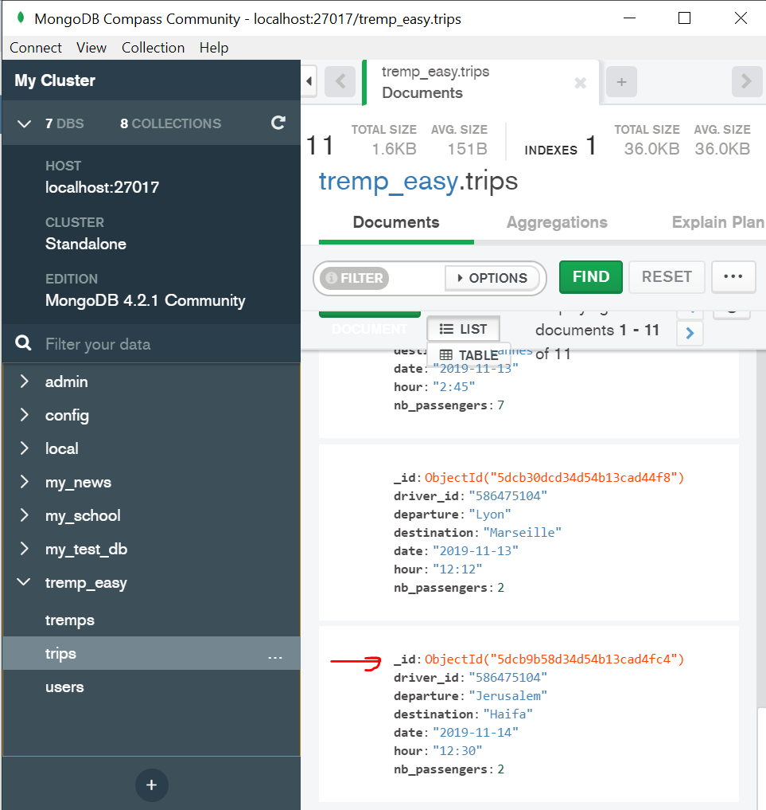
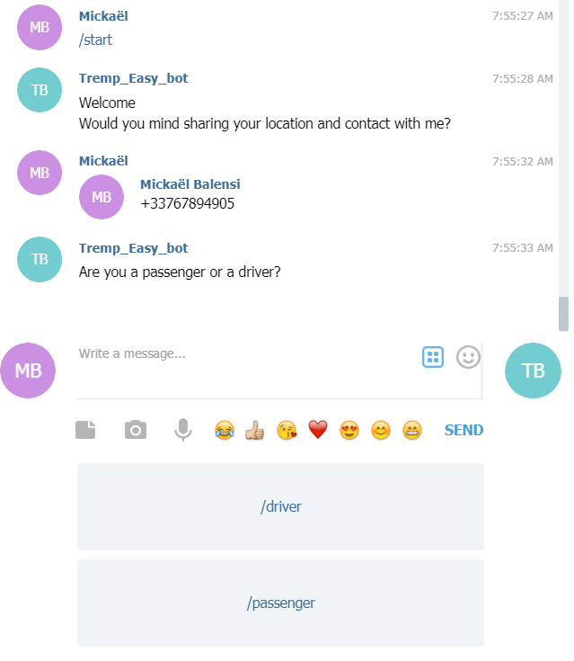
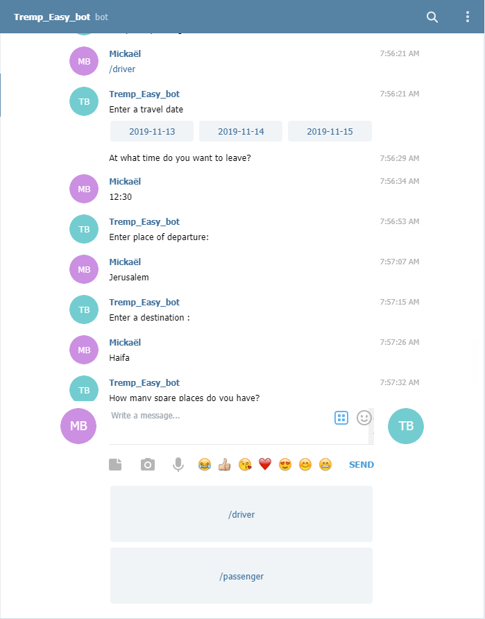
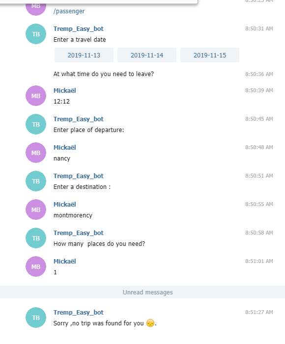
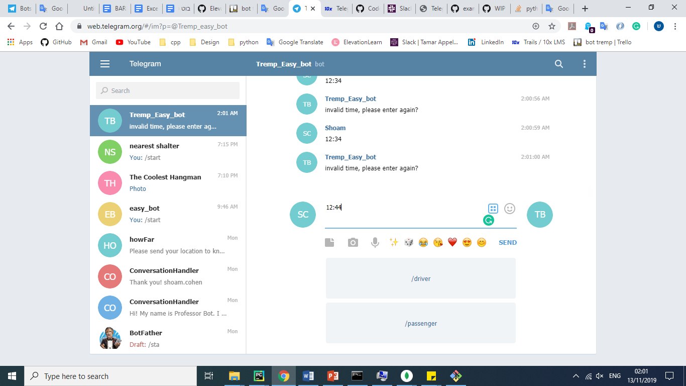
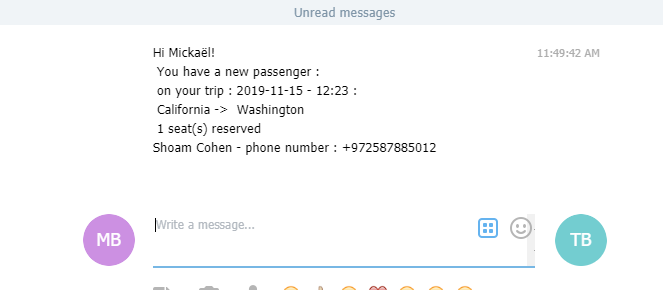

Tremp_easy
<https://t.me/@Tremp_easy_bot>

Bot that offer easy platform to share your car trip with others, offers them a simply way to contact the driver wihtout knowing him, wihtout Watsapp incessant messages disturbing your daily life, just by enter your details research and automatically update the driver from new passenger by sending him your phone number.

* Shoam Cohen
* Shani Ehrentreu
* Deborah Balensi

## Screenshots

## How to Run This Bot
### Prerequisites
* Python 3.7
* MongoDB
* Telegram App

### Setup
* Clone this repo from github
* Install dependencies: `pipenv install`
* Get a BOT ID from the [botfather](https://telegram.me/BotFather).
* Create a `secret_settings.py` file:

        BOT_TOKEN = "your-bot-token-here"

### Run
To run the bot use:

    pipenv run python bot.py

### Running tests
First make sure to install all dev dependencies:

    pipenv install --dev

To run all test  use:

    pipenv run pytest

(Or just `pytest` if running in a pipenv shell.)

## Credits and References
* [Telegram Docs](https://core.telegram.org/bots)
* [python-telegram-bot](https://github.com/python-telegram-bot/python-telegram-bot)
* [MongoDB Documentation](https://docs.mongodb.com/manual/)
* [Udi Material](http://lms.10x.org.il/)
* [Nominatim API](https://nominatim.openstreetmap.org/)
* [Nehama Verbov for her precious help with GIT operations]
* [Amitai, Udi, Ola, Michal, Margalit for tutoring and support ]
